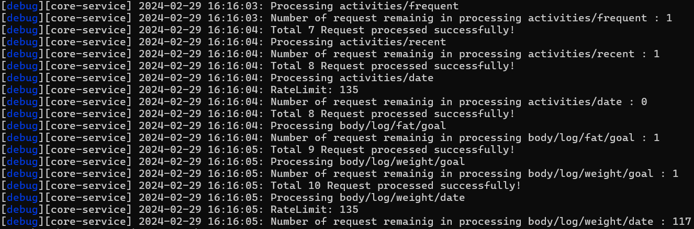

<!-- omit from toc -->
# Fitbit API Integration

- [Introduction](#introduction)
- [Dependencies](#dependencies)
- [Database](#database)
- [Architecture and Design](#architecture-and-design)
- [Flow of Request and Response Handling](#flow-of-request-and-response-handling)
  - [Flow of Sending a Request](#flow-of-sending-a-request)
  - [Flow of Sending Back the Response](#flow-of-sending-back-the-response)
- [Implementation Details](#implementation-details)
  - [Endpoint](#endpoint)
  - [Scheduler](#scheduler)
  - [Scope](#scope)
  - [Logging](#logging)
- [Scalability](#scalability)
  - [Resource](#resource)
  - [Functionalities](#functionalities)

## Introduction

The integration of the Fitbit API into the Carecentive app involves several key components. Details of each of these elements are discussed below to gain a comprehensive understanding of the integration.

## Dependencies

Libraries already utilized in the Carecentive core, such as Axios, Knex, Winston, etc., are leveraged for integration.

## Database
Two entities are used to store user's Fitbit data:

1. **user_fitbit_tokens**: This table is utilized to store user credentials, including Carecentive user ID, Fitbit user ID, tokens, scope, etc.

2. **user_fitbit_data**: This table is employed to store the actual response polled from the web API for the registered users.

## Architecture and Design

A layered design is employed for improved readability and maintainability of the code.

A total of three core classes are utilized:
* [**Fitbit Manager**](../../services/fitbit/FitbitManager.js): Acts as an entry point for fetching user data from the web API and storing it into a database.
* [**API Manager**](../../services/fitbit/api/ApiManager.js): Processes the API requests using resources and sends back the responses to the caller.
* [**DB Manager**](../../services/fitbit/db/DBManager.js): Handles the database operations such as read, insert, update, delete, etc.

## Flow of Request and Response Handling

This section outlines the flow of handling requests and responses within the Fitbit API integration. It describes how requests are initiated, processed, and responded to, as well as how the resulting data is stored.

### Flow of Sending a Request

1. The Fitbit Manager initiates requests and stores responses. It transfers the request to a worker class, the Request Processor, for further processing.
2. The Request Processor utilizes utility and helper methods such as Fitbit Helper, DateTimeUtils, Scope, etc., to forward the request to the API Manager.
3. The API Manager forwards the request to resources such as Intraday, TimeSeries, Summary, Pagination, etc.
4. The resources generate endpoints and pass the requests to the API Request.
5. The API Request executes the actual requests to the Fitbit Web API.

### Flow of Sending Back the Response

1. Responses from the Fitbit Web API are sent back to resources by the API Request.
2. The resources return the response to the API Manager.
3. The API Manager sends the data back to the Request Processor.
4. The Request Processor processes the response and sends it to the DB Manager for storage.
5. The DB Manager performs the actual storage operation in the database.

## Implementation Details

### Endpoint

All API endpoints from the Fitbit Web API are implemented, categorized into five types of resources:

1. Authorization
2. Summary data
3. Intraday data
4. Timeseries data
5. Pagination data

### Scheduler

A scheduler task is necessary due to the Fitbit Web API's limit on processing requests per user within a specific time frame. To manage this, a Scheduler class and a Rate limit class are utilized to handle various scenarios.

### Scope

Two types of scopes are managed throughout the integration:

1. Scope granted by the user: Users provide consent to the necessary scopes during authorization.
2. Scope defined by the developer: Scopes defined in the config file provide developers with more control over request processing. These scopes can be disabled or enabled by the developer. By default, all scopes are enabled.

### Logging

Logging generates output in the console and is also stored in the central log file(combined.log) in the carecentive framework.

A debugging feature is implemented to offer more detailed information during execution. It can be enabled or disabled in the config file. The `Logger.debug("")` function prints debug information if enabled.

## Scalability

### Resource

A resource file can be created for a new pattern of resources or use the existing one to participate in the request and response flow.

### Functionalities

This structure can be easily adapted to object-oriented and statically typed languages with minimal changes. Additionally, its modularity provides greater freedom to scale.
