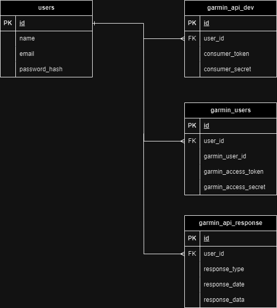

# Carecentive.net Garmin API Integration

This project enables users to connect their Garmin Connect account to Carecentive.net and therefore sharing their health & activity gathered by Garmin smart devices.

# Dependencies

This project uses
1. [Axios](https://www.npmjs.com/package/axios) for Web requests
2. [Knex](https://knexjs.org/) for database migration & query building
3. [Crypto](https://nodejs.org/api/crypto.html) for OAuth signing processes
4. [Moment](https://momentjs.com/) for date/time related parsing/manipulation
   
# Implementation
In the following, the implementation of the Garmin API integrations is explained and the control & information flow visualized for better understanding of the code.
The main components consist of
1. *GarminAuth.js* -  handles the authorization process when a new user wants to grant Carecentive access to their Garmin data.
2. *GarminSerices.js* -  handles the API requests made to the Garmin API for pulling health related data from Carecentive users.
3. *GarminDB.js* - handles everything database related.
## Database Structure
The database structure consists of three tables referencing the main Carecentive user table.
In *garmin_api_dev*, the Garmin API developer token and secret are stored, which can be found in the garmin developer portal after creating an account and approved application.
In *garmin_users*, users that have connected their Garmin account to Carecentive are stored, with their garmin_user_id, access_token and access_secret. This data allows Carecentive to sign requests to the Garmin API and pull user data.
In *garmin_api_responses*, the unformated .json response of the APi requests are stored. They are categorized by response_typ (e.g. daily_summary), response_date, being the date the data was gathered on the Garmin device and the complete response body in response_data.

## Registering a user

The following sequence diagram depicts the process in the carecentive backend when a user decides to connect their Garmin Connect account to Carecentive.
The developer creates an application in the Garmin Developer Portal, which, when approved, grants them a *consumer_token* and *consumer_secret*.
These parameters are used to verify to the Garmin API, that you are a registered developer and are authorized to access user data.
After initiating, the user gets redirected to a Garmin page, allowing them to select what data exactly to share with Carecentive. After going through this process Carecentive receives an *access_token* and *access_secret* from the API while the user gets redirected to the callback url. The user's authorization data and their Garmin *user_id* are saved to the database.
In combination with the user and developer authorization data, requests to the Garmin API can be signed to gather health and activity data, collected by the users Garmin Smart devices.

## Making an API Request

As explained in the previous section, with the gathered authorization data, the Carecentive framework enables developers to request the users health and activity data from the Garmin API. Next to the authorazation data, the developer needs to pass a start- and endtimestamp to the specific API's URL. The URL specifies which API the request is made to, the timestamps correspond to the timeframe the data was uploaded from the Garmin device to Garmin Connect. The calendar date the data has been collected on the device originally is stored together with the raw .json response in the Carecentive database. For API features like daily summaries, that could be uploaded multiple times a day partially, a logic is implemented that always replaces the current data in the database with the most complete data for this specific day so no multiple entries occur. 

## Logging & Error Handling

At important steps in each of the processes, short and concise logging and/or error messages will be put out to the console.

## Good to know

Garmin offers two kind of applications for your project: Evaluation applications and Production applications. Evaluation applications have are rate limited, the maximum rate isn't specified, but pulling a lot of data for many users in short time frames could lead to problems. If you applied for a production application, the are no rate restrictions

## Extendability

Currently the implementation offers access to three API types. Daily sleep & health summaries and activites. The data contained in these api responses cover most of the data gathered by Garmin. In the Garmin Developer Portal, Garmin offers documentation to further types of API endpoints that can used. To integrate these into Carecentive, take a look at *GarminServices.js*. Here is a little code snippet.

`const getDailySummaries = async (userId, starttime, endtime) => {
   const url = 'https://apis.garmin.com/wellness-api/rest/dailies';
    await makeApiRequest(url, userId, "daily_summary", starttime, endtime);
};`
  
`const getSleepSummaries = async (userId, starttime, endtime) => {
  const url = 'https://apis.garmin.com/wellness-api/rest/epochs';
  await makeApiRequest(url, userId, "sleep_summary", starttime, endtime);
};`

As you see, adding another type of api doesn't require many changes in the code. Just add another function with the new url and pass the type of api request to the *makeApiRequest* function. Depending on the delivered data of the response, small changes to the further data handling could be required.